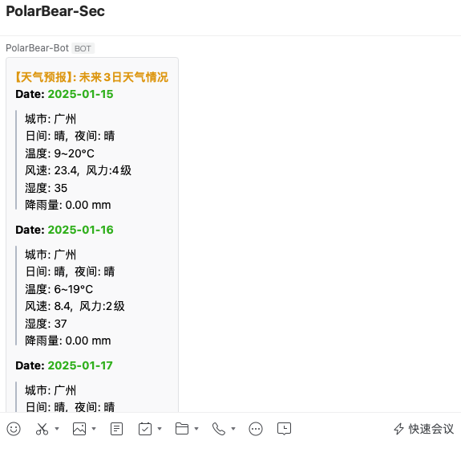
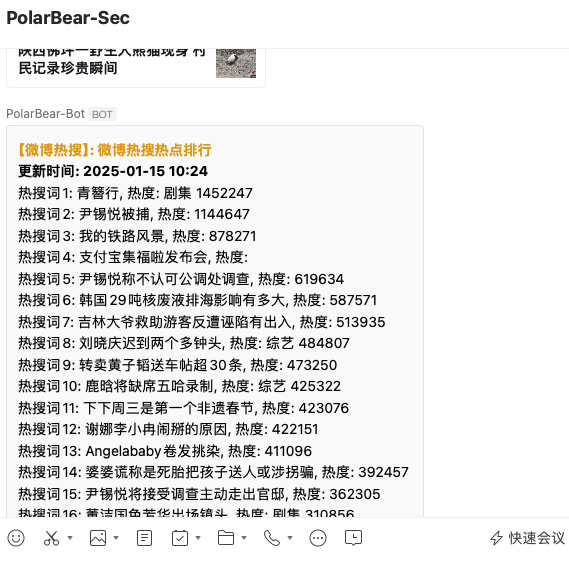
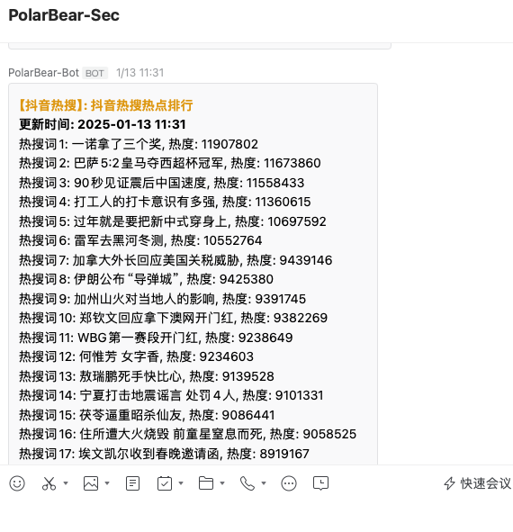

## Enterprise WeChat Group Robot Message Push - PolarBearRobot


- [English](./doc/README_en.md)
- [中文](./doc/README_zh.md)
---
### 0x0 Preface
- This project is developed based on Python 3.12 and deployed using Docker.

- This project fetches information from public API interfaces and uses the Enterprise WeChat group robot to push messages, enabling notification functionality.

- Currently, the daily push content includes weather, news, Weibo hot searches, and Douyin hot searches. Additional features will be added in the future.

- This project is an open-source project aimed at helping developers learn and research related technologies.

### 0x1 Disclaimer
**This project is for learning, communication, and research purposes only. It is strictly prohibited to use it for any illegal purposes. Users are responsible for their own actions, and the author is not responsible for any direct or indirect consequences arising from the use of this project.**

- **Legal Use:** Please ensure compliance with the laws and regulations of your country or region when using this project.

- **Prohibition of Misuse:** It is strictly prohibited to use this project for any illegal activities, including but not limited to network attacks, data theft, malware distribution, etc.

- **User Responsibility:** Users are responsible for their own actions, and the author is not liable for any misuse.
---

### 0x2 Usage Instructions
#### Technology Stack
- python3.12
- docker

```
Create a robot in the Enterprise WeChat group:
Record the webhook URL.

Build the Docker image:
docker build -t polarbear:1.0.1 .

Fill in the API key, webhook URL, and other information in the configuration file:
PolarBear/polarbear/Config/config.yaml

Start the container using the script to launch the docker-compose file:
./bear_start.sh


```
---

### 0x3 Project Structure
```
├── bear_start.sh
├── bear_stop.sh
├── build.py
├── doc
├── docker-compose.yml
├── Dockerfile
├── LICENSE
├── main.py
├── polarbear
│   ├── ApiServer
│   ├── BotServer
│   ├── Config
│   ├── DBServer
│   ├── __init__.py
│   ├── Log
│   ├── PushServer
│   └── __pycache__
├── README.md
├── requirements.txt
├── site-packages
│   ├── anyio...
├── task_state.json
└── test
    ├── test.py...

```
### 0x4 Project Screenshots
- Weather：

- News：

- weibo Hot Searches：

- douyin Hot Searches：



### 0x5 Backup
```
导出项目requirements.txt:
cd polarbear && pipreqs ./ ----encoding=utf8


```
### Communication and Feedback

- If you have any questions or suggestions, feel free to contact me via [Issues](https://github.com/Samsepik9/PolarBearRobot/issues). I check messages periodically and will respond. This project encourages healthy communication and a learning atmosphere. 

- If you like this project, please give it a star. Thank you for your support! If you particularly enjoy this project, you can also buy me a coffee👽. Thank you for your support!
- Donate:
    
